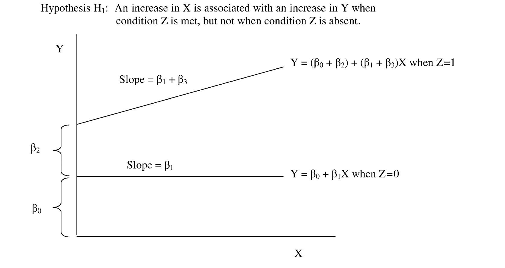

```{r,  message = NA}
#| label: setup
#| include: false
#| eval: true
library(tidyverse)
library(brms)
library(bayesplot)
library(patchwork)

# ─────────────────────────────────────────────────────────────────────────────
# SHARED COLOURS
# ─────────────────────────────────────────────────────────────────────────────
col_1 <- "steelblue"
col_2 <- "#E07B39"
col_3 <- "#7B3F9E"
col_4 <- "goldenrod3"
chain_cols <- c(col_1, col_2, col_3, col_4)

# ─────────────────────────────────────────────────────────────────────────────
# UNIFIED DATASET: Women in Parliament → Health Spending (moderated by regime type)
# Same DGP as Week 9 — we continue with the same substantive story.
#
# True DGP:
#   gdp_pc       ~ Normal(18, 7)           [thousands USD, PPP]
#   women_parl   = 15 + 0.9*gdp_pc + N(0, 5)
#   reg_type     ~ Bernoulli(0.55)         [1 = parliamentary, 0 = presidential]
#   health_spend = 2 +
#     0.2  * gdp_pc       +
#     0.08 * women_parl   +   [baseline women effect, presidential systems]
#     1.5  * reg_type     +   [parliamentary intercept shift]
#     0.10 * women_parl * reg_type +   [stronger women slope in parliamentary]
#     N(0, 1.5)
#
# Women in parliament slope:
#   Presidential (reg_type = 0): β_women = 0.08
#   Parliamentary (reg_type = 1): β_women = 0.08 + 0.10 = 0.18
# ─────────────────────────────────────────────────────────────────────────────
set.seed(2026)
n <- 120

gdp_pc <- rnorm(n, mean = 18, sd = 7)
women_parl <- 15 + 0.9 * gdp_pc + rnorm(n, 0, 5)
reg_type <- rbinom(n, 1, prob = 0.55) # 1 = parliamentary, 0 = presidential
health_spend <- 2 +
  0.2 * gdp_pc +
  0.08 * women_parl +
  1.5 * reg_type +
  0.10 * women_parl * reg_type +
  rnorm(n, 0, 1.5)

df <- tibble(gdp_pc, women_parl, reg_type, health_spend) |>
  mutate(system = if_else(reg_type == 1, "Parliamentary", "Presidential"))

# Additive multivariate model from Week 9 — used as the comparison baseline in LOO
fit_multi <- brm(
  health_spend ~ women_parl + gdp_pc + reg_type,
  data = df,
  prior = c(
    prior(normal(10, 5), class = "Intercept"),
    prior(normal(0, 2), class = "b", coef = "women_parl"),
    prior(normal(0, 2), class = "b", coef = "gdp_pc"),
    prior(normal(0, 2), class = "b", coef = "reg_type"),
    prior(exponential(1), class = "sigma")
  ),
  chains = 4,
  iter = 2000,
  warmup = 1000,
  seed = 2026
)

# Interaction model — the focus of Week 10
fit_interact <- brm(
  health_spend ~ women_parl * reg_type + gdp_pc,
  data = df,
  prior = c(
    prior(normal(10, 5), class = "Intercept"),
    prior(normal(0, 2), class = "b", coef = "women_parl"), # presidential slope
    prior(normal(0, 2), class = "b", coef = "reg_type"), # parliamentary shift
    prior(normal(0, 2), class = "b", coef = "gdp_pc"), # GDP partial effect
    prior(normal(0, 2), class = "b", coef = "women_parl:reg_type"), # slope difference
    prior(exponential(1), class = "sigma")
  ),
  chains = 4,
  iter = 2000,
  warmup = 1000,
  seed = 2026
)
```

## QMIR 2026 {#sec-title}

::: notes
- Opening. We continue with the same dataset and substantive story from Week 9.
- Arc: formal overview of interactions → live application → canonical workflow recap.
- In Week 9 we established that women's parliamentary representation is associated with health spending after controlling for GDP and regime type. Today we ask whether that association is the same across both system types.
- The data are synthetic and the DGP is known — the true interaction coefficient is β₃ = 0.10.
:::

### Week 10: Interactions

{width="100%"}  <a href="https://github.com/dertristan" target="_blank" style="text-decoration: none; margin-left: 10px;"> <svg xmlns="http://www.w3.org/2000/svg" width="20" height="20" fill="currentColor" class="bi bi-github" viewBox="0 0 16 16"> <path d="M8 0C3.58 0 0 3.58 0 8c0 3.54 2.29 6.53 5.47 7.59.4.07.55-.17.55-.38 0-.19-.01-.82-.01-1.49-2.01.37-2.53-.49-2.69-.94-.09-.23-.48-.94-.82-1.13-.28-.15-.68-.52-.01-.53.63-.01 1.08.58 1.23.82.72 1.21 1.87.87 2.33.66.07-.52.28-.87.51-1.07-1.78-.2-3.64-.89-3.64-3.95 0-.87.31-1.59.82-2.15-.08-.2-.36-1.02.08-2.12 0 0 .67-.21 2.2.82.64-.18 1.32-.27 2-.27s1.36.09 2 .27c1.53-1.04 2.2-.82 2.2-.82.44 1.1.16 1.92.08 2.12.51.56.82 1.27.82 2.15 0 3.07-1.87 3.75-3.65 3.95.29.25.54.73.54 1.48 0 1.07-.01 1.93-.01 2.2 0 .21.15.46.55.38A8.01 8.01 0 0 0 16 8c0-4.42-3.58-8-8-8"/> </svg> </a> <a href="mailto:tristan.muno@uni-mannheim.de" style="text-decoration: none; margin-left: 5px;"> <svg xmlns="http://www.w3.org/2000/svg" width="20" height="20" fill="currentColor" class="bi bi-envelope" viewBox="0 0 16 16"> <path d="M0 4a2 2 0 0 1 2-2h12a2 2 0 0 1 2 2v8a2 2 0 0 1-2 2zm2-1a1 1 0 0 0-1 1v.217l7 4.2 7-4.2V4a1 1 0 0 0-1-1zm13 2.383-4.708 2.825L15 11.105zm-.034 6.876-5.64-3.471L8 9.583l-1.326-.795-5.64 3.47A1 1 0 0 0 2 13h12a1 1 0 0 0 .966-.741M1 11.105l4.708-2.897L1 5.383z"/> </svg> </a> <br> 

---

## Week 10 Learning Goals {#sec-goals .smaller}

::: notes
- Read aloud. Three goals map onto two parts + summary.
- Goal 1 → Part I (formal theory); Goals 2–3 → Part II (application).
- These goals build directly on Week 9: students already have the multivariate model and LOO-IC; today they extend it with an interaction.
:::

By the end of today, you should be able to:

1. Specify a **multiplicative interaction model** and interpret the conditional marginal effect of `women_parl` as a function of `reg_type` (the moderator)
2. Extract **posterior marginal effects** for the women-in-parliament–health-spending association separately for presidential and parliamentary systems
3. Compare the interaction model against the additive model using **Bayesian leave-one-out cross-validation** (LOO-IC)

# Part I: Interaction Terms {#sec-part1}

## When Effects Are Conditional {#sec-part1-intro .smaller}

::: notes
- The key insight: not all associations are the same everywhere. The association between X and Y may depend on a third variable Z.
- Real political science logic: parliamentary systems concentrate budget authority in the legislature (budget sovereignty, party discipline). Presidential systems divide power across branches (executive vs legislature). So the composition of parliament — how many women — may matter more for spending outcomes in parliamentary systems.
- "A model without an interaction term is implicitly assuming the slope is constant across all levels of Z. That is a strong assumption. Test it before imposing it."
- Transition: "We already have this dataset. We already have regime type. We just need to ask a different question of the same data."
:::

> **Does the association between female legislator share and health spending vary by regime type?**

. . .

::: {style="font-size: 0.72em"}
**Legislative composition theory**: parliamentary systems concentrate budget authority in the legislature — party discipline is stronger, and the budget process is rooted in parliamentary sovereignty. Presidential systems divide power across branches, potentially weakening the translation of legislative preferences into policy.
:::

. . .

:::::: columns
::: {.column width="55%" style="font-size: 0.72em"}

The association between $X$ (women in parliament) and $Y$ (health spending) is **not constant** — it may change depending on $Z$ (regime type). This is called **moderation** or **association heterogeneity**.

> "The slope of the women-in-parliament–health-spending association is steeper in parliamentary systems."

:::

::: {.column width="45%"}

::: {.callout-note style="font-size: 0.75em"}
**Same dataset as Week 9**: $n = 120$ country-years.

- $X$ = Women in parliament (%)
- $Z$ = Regime type (0 = presidential, 1 = parliamentary)
- $Y$ = Health spending (% GDP)

True slopes: Presidential = **0.08**, Parliamentary = **0.08 + 0.10 = 0.18**
:::

:::
::::::

---

## The Formal Interaction Model {#sec-interact-formal .smaller}

::: notes
- Walk through the partial derivatives carefully.
- ∂μ/∂X = β₁ + β₃Z: "The slope of X (women in parliament) on Y (health spending) is a linear function of Z (regime type). When Z = 0 (presidential), the slope is β₁ = 0.08. When Z = 1 (parliamentary), the slope is β₁ + β₃ = 0.18."
- ∂μ/∂Z = β₂ + β₃X: "The regime-type gap in spending also depends on X. At zero women in parliament, being parliamentary adds β₂ = 1.5 pp. At 30% women, it adds β₂ + 30β₃."
- Constitutive terms: "β₁ and β₂ are the conditional associations when the other modifier equals zero. They must be included. Omitting β₁ imposes β₁ = 0 — usually wrong."
:::

We augment the linear predictor with a **product term**:

$$
\mu_i = \alpha + \beta_1 X_i + \beta_2 Z_i + \beta_3 (X_i \cdot Z_i)
$$ {#eq-interact-model}

. . .

**Conditional marginal effects** — both slopes are now *functions* of the other variable:

$$
\frac{\partial \mu}{\partial X} = \beta_1 + \beta_3 Z \qquad \text{(women-in-parliament slope depends on regime type)}
$$ {#eq-interact-me-x}

$$
\frac{\partial \mu}{\partial Z} = \beta_2 + \beta_3 X \qquad \text{(regime-type gap depends on women-in-parliament level)}
$$ {#eq-interact-me-z}

. . .

**Two regression lines** (when $Z$ is binary):

::: {style="font-size: 0.82em"}
$Z = 0$ (presidential): $\mu = \alpha + \beta_1 X + \beta_Z \cdot \text{GDP}$

$Z = 1$ (parliamentary): $\mu = (\alpha + \beta_2) + (\beta_1 + \beta_3) X + \beta_Z \cdot \text{GDP}$
:::

The dummy shifts the **intercept** by $\beta_2$; the product shifts the **slope** of women in parliament by $\beta_3$.

---



---

## Posterior Marginal Effects: Exact by Arithmetic {#sec-posterior-me .smaller}

::: notes
- The key insight: the conditional marginal effect is a function of β₁ and β₃. Because we have full posterior draws for both, we can compute the marginal effect at any z by simple arithmetic — no approximation needed.
- For every MCMC draw (β₁^(s), β₃^(s)), compute β₁^(s) + β₃^(s)*z directly. The resulting set of S values IS the posterior distribution of the conditional marginal effect at z.
- "This is not a minor technical point. It means posterior credible intervals for conditional marginal effects are exact — not approximate — as long as MCMC has converged."
- The same principle generalises: any quantity that is a function of parameters can be obtained by applying that function to each row of the posterior draws data frame.
:::

For each of the $S$ MCMC draws, compute the **conditional marginal effect** at a fixed value $z$ of the moderator:

$$
\text{ME}^{(s)} = \beta_1^{(s)} + \beta_3^{(s)} \cdot z
$$ {#eq-bayes-me}

The resulting $\{\text{ME}^{(s)}\}_{s=1}^S$ **is** the posterior distribution of the marginal effect at $z$ — obtained by ordinary arithmetic.

. . .

```{r}
#| eval: false
# as_draws_df: one row per MCMC draw, one column per parameter
post <- as_draws_df(fit_interact)
post |>
  mutate(
    me_parliamentary = b_women_parl + # marginal effect at Z = 1 (parliamentary)
      `b_women_parl:reg_type`,
    me_presidential = b_women_parl # marginal effect at Z = 0 (presidential)
  )
```

. . .

::: {.callout-note style="font-size: 0.72em"}
**This generalises immediately**: compute *any* quantity that is a function of posterior draws using ordinary arithmetic — predicted probabilities, differences in predicted values, ratios, non-linear transformations. No additional packages or approximations needed.
:::

---

## Diagnostic I: Linearity of Moderation {#sec-diag-linearity .smaller}

::: notes
- The interaction model assumes the heterogeneous effect is LINEAR in Z. "The slope increases by β₃ for each unit increase in Z." This is a strong assumption.
- Brambor et al. (2006) show this assumption is violated in roughly half of empirical studies.
- Diagnostic: compare linear fit vs. LOESS within each Z-group. If LOESS and the linear fit track closely, linearity holds. If they diverge substantially, the interaction may be non-linear.
- For binary Z: linearity of moderation means the slope changes by a constant amount between groups. This is inherently satisfied for a binary moderator — there are only two levels.
- For continuous Z: this diagnostic matters. We'll see this in future weeks.
:::

::: {style="font-size: 0.82em"}
The interaction model imposes that the marginal effect of $X$ is **linear in** $Z$:

$$
\frac{\partial \mu}{\partial X} = \beta_1 + \beta_3 Z \quad \text{(linear in } Z\text{)}
$$ {#eq-linearity-mod}
:::

. . .

::: {style="font-size: 0.82em"}
**When $Z$ is binary** (our case today): the assumption is trivially satisfied — there are only two groups and we estimate one slope per group.
:::

. . .

::: {style="font-size: 0.82em"}
**When $Z$ is continuous** (a future concern): check by comparing the linear fit with a flexible nonparametric smoother (LOESS) within groups of $Z$:
:::

```{r}
#| label: fig-linearity-check
#| echo: false
#| fig-height: 2.4
#| fig-cap: "Linearity check for a moderator: Across groups ($Z = 0$, $Z = 1$), check if line is appropriate representation of relationship"
ggplot(
  data = df,
  aes(x = women_parl, y = health_spend, color = as.factor(reg_type))
) +
  geom_point() +
  geom_smooth(method = "lm") +
  geom_smooth(method = "loess") +
  theme_bw()
```

---

## Continuous Moderators: Interpreting the Interaction Coefficient {#sec-continuous-interact .smaller}

::: notes
- When Z is continuous, the marginal effect of X is a *continuously changing* function of Z.
- At Z = 0: ME = β₁. At Z = 1: ME = β₁ + β₃. At Z = z: ME = β₁ + β₃ * z.
- Geometrically: the relationship between X and Y is a family of lines, each line corresponding to a fixed value of Z. The slope increases (or decreases) continuously as Z changes — like twisting a flat surface into a ramp.
- In the 2D cross-section you draw X vs Y at three fixed values of Z (low, mid, high). Three parallel lines? No interaction. Fan-shaped divergence? Positive β₃.
:::

When $Z$ is **continuous**, the conditional marginal effect $\frac{\partial \mu}{\partial X} = \beta_1 + \beta_3 Z$ is a continuous linear function of $Z$:

- At $Z = 0$: the effect of $X$ is $\beta_1$
- At $Z = 1$: the effect of $X$ is $\beta_1 + \beta_3$
- At $Z = z$: the effect of $X$ is $\beta_1 + \beta_3 z$ — the slope **changes continuously** as $Z$ changes

. . .

```{r}
#| label: fig-continuous-interact-lines
#| echo: false
#| fig-height: 3.0
#| dpi: 500
#| fig-cap: "Predicted Y vs. X at three fixed values of a continuous moderator Z (low = -1, median = 0, high = +1), using hypothetical coefficients β₁ = 0.5, β₃ = 0.8. The fan-shaped divergence is the visual signature of a positive interaction term."
# hypothetical coefficients for illustration (no dataset needed)
expand_grid(
  x = seq(-2, 2, length.out = 60),
  z_val = c(-1, 0, 1)
) |>
  mutate(
    y_hat = 0 + 0.5 * x + 0.8 * x * z_val, # α=0, β₁=0.5, β₃=0.8
    z_label = factor(
      case_match(
        z_val,
        -1 ~ "Z low (-1)",
        0 ~ "Z median (0)",
        1 ~ "Z high (+1)"
      ),
      levels = c("Z low (-1)", "Z median (0)", "Z high (+1)")
    )
  ) |>
  ggplot(aes(x = x, y = y_hat, colour = z_label)) +
  geom_line(linewidth = 1.1) +
  scale_colour_manual(values = c(col_1, col_4, col_2), name = NULL) +
  theme_bw() +
  theme(panel.grid.minor = element_blank(), legend.position = "bottom") +
  labs(
    x = "X",
    y = expression(hat(mu)),
    title = "Conditional Marginal Effect of X Varies with Z",
    subtitle = expression(
      paste(
        frac(partialdiff * mu, partialdiff * X),
        " = ",
        beta[1] + beta[3] * Z,
        "   (fan = positive interaction)"
      )
    )
  )
```

---

## Diagnostic II: Common Support {#sec-diag-support .smaller}

::: notes
- Common support: we need sufficient variation in X within each level of Z. If X only takes high values when Z=0 and low values when Z=1, we are extrapolating, not estimating.
- "We cannot estimate the slope for parliamentary systems at 5% women in parliament if no parliamentary country in our data has 5% women. The model will extrapolate — and extrapolation is unreliable."
- Diagnostic: density/histogram of women_parl, faceted by regime type. If the distributions overlap substantially, we have common support. If they are disjoint, we are in trouble.
- For today's binary Z case: the setup uses rbinom(n, 1, 0.55) so parliamentary and presidential systems are roughly evenly split. Both groups see the full range of women_parl. Common support is satisfied by design.
:::

**Common support**: the estimation of conditional marginal effects is credible only where women in parliament (%) has sufficient variation *within each regime-type group* (presidential vs. parliamentary).

. . .

Diagnostic: compare the distribution of women in parliament across regime-type groups.

```{r}
#| label: fig-common-support
#| echo: false
#| fig-height: 2.4
#| fig-cap: "Common support check: compare the Women in Parliament (%) distribution across regime-type groups. Left: good overlap — we can estimate marginal effects for both presidential and parliamentary systems across the full range. Right: poor overlap — estimates in the non-overlapping regions are extrapolations, not estimates."
set.seed(8)
n_cs <- 200

df_good <- tibble(
  x = c(rnorm(n_cs, 5, 2), rnorm(n_cs, 5, 2)),
  group = rep(c("Z = 0", "Z = 1"), each = n_cs),
  case = "Good common support"
)
df_bad <- tibble(
  x = c(rnorm(n_cs, 3, 1.2), rnorm(n_cs, 8, 1.2)),
  group = rep(c("Z = 0", "Z = 1"), each = n_cs),
  case = "Poor common support"
)

bind_rows(df_good, df_bad) |>
  mutate(
    case = factor(
      case,
      levels = c("Good common support", "Poor common support")
    )
  ) |>
  ggplot(aes(x = x, fill = group, colour = group)) +
  geom_density(alpha = 0.35, linewidth = 0.8) +
  scale_fill_manual(values = c(col_1, col_2), name = NULL) +
  scale_colour_manual(values = c(col_1, col_2), name = NULL) +
  facet_wrap(~case) +
  theme_bw() +
  theme(panel.grid.minor = element_blank(), legend.position = "bottom") +
  labs(
    x = "Women in Parliament (%)",
    y = "Density",
    title = "Common Support Check",
    subtitle = "Compare Women in Parliament (%) distribution across regime-type groups"
  )
```

::: {style="font-size: 0.78em"}
**Rule**: if the women-in-parliament distributions barely overlap across presidential and parliamentary countries, the conditional marginal effects in the non-overlapping region are **extrapolations**, not **estimates**. Report honestly.
:::

---

## The Constitutive Terms Rule {#sec-constitutive .smaller}

::: notes
- This is a common and consequential mistake. Students will make it.
- "If you use `health_spend ~ women_parl:reg_type` instead of `health_spend ~ women_parl * reg_type`, you are constraining β₁ = 0 and β₂ = 0. You are saying: 'In presidential systems, women in parliament has no association with health spending. With zero women in parliament, there is no difference between systems.' This is almost never true."
- "Always use `*`. The model with constitutive terms is more general; the model without them is a special case with two hard constraints. Let the data decide."
- In brms: `y ~ x * z` expands to `y ~ x + z + x:z` automatically. Use the `*` notation as shorthand and as a reminder of the requirement.
:::

**Always include the main effects** ($X$, $Z$) when specifying an interaction $(X \cdot Z)$:

:::::: columns
::: {.column width="50%"}

::: {.callout-important style="font-size: 0.75em"}
**Wrong**: omitting constitutive terms

```r
brm(y ~ x:z, ...)
# implicitly: β₁ = 0 and β₂ = 0
# At Z = 0: no effect of X
# At X = 0: no effect of Z
# These are strong constraints, usually false
```
:::

:::

::: {.column width="50%"}

::: {.callout-note style="font-size: 0.75em"}
**Correct**: include all constitutive terms

```r
brm(y ~ x * z, ...)
# equivalent to: y ~ x + z + x:z
# β₁, β₂, β₃ all estimated freely
# No artificial constraints imposed
```
:::

:::
::::::

. . .

::: {style="font-size: 0.82em"}
**In `brms`**: `y ~ x * z` is the recommended syntax. It expands to `y ~ x + z + x:z` automatically and documents the constitutive terms requirement.

**Prior for** $\beta_3$: $\text{Normal}(0, 2)$ is a sensible weakly informative prior. It says: *"Before seeing the data, the slope difference between groups is probably between* $-6$ *and* $+6$ *— no moderation is the prior expectation."*
:::

# Part II: Application — Interaction `brms` Model {#sec-part2}

## Part II: Applied — Live Coding {#sec-part2-live}

*→ Switch to Positron. Follow along in `lab/week10_lab.qmd`.*

In this application we fit `fit_interact` using `health_spend ~ women_parl * reg_type + gdp_pc` on the same `df` dataset from Week 9, then compare it against `fit_multi` (no interaction) via LOO-IC.

---

# Summary {#sec-summary}

## The Canonical Workflow {#sec-workflow .smaller}

::: notes
- Read through the eight steps. This workflow applies regardless of model type.
- "Every analysis you submit must have these eight elements — bivariate, multivariate, interaction, logistic (Week 11), multilevel (Week 12). The likelihood changes; the workflow does not."
- Spend a few minutes on Q&A. Ask students: "Which step felt least familiar today?" and plan accordingly.
:::

The same eight-step workflow applies to **every** model, regardless of complexity:

. . .

::: {style="font-size: 0.7em"}
| Step | What you do | Why |
|------|-----------------|-----------------|
| 1. DAG + Estimand | Draw the causal graph; state the quantity of interest | Clarifies what you're estimating and what to control for |
| 2. Data Summary | Visualise and numerically describe your variables | Check for patterns, outliers, and whether an interaction is plausible |
| 3. Formal Model | Write out $\mathcal{L}$ and all priors before coding | Forces precision; makes assumptions explicit |
| 4. Prior Predictive | Simulate $Y$ from priors; check plausibility | Catches implausible priors before MCMC |
| 5. Fit with `brms` | Run `brm()` with explicit priors | Obtains posterior draws |
| 6a. MCMC Diagnostics | Check $\hat{R}$, ESS, traceplots | Confirms convergence before interpreting |
| 6b. PPC | Run `pp_check()` | Checks model adequacy |
| 7. Interpretation | Posterior summaries, credible intervals, marginal effects | Answers the research question |
| 8. Limitations | State what could still bias results | Scientific honesty |
:::

---

## Learning Goals: Check {#sec-goals-check .smaller}

::: notes
- Read through quickly. Connect each goal to the part of today's session where it was covered.
- Homework: students will apply the full workflow including an interaction term to a real dataset.
- Week 11 preview: generalized linear models — the Gaussian likelihood is replaced by Bernoulli. The workflow stays the same.
:::

::: {style="font-size: 0.82em"}
By the end of today, you should be able to:

1. ✓ Specify a **multiplicative interaction model** and interpret $\partial \mu / \partial \text{women\_parl} = \beta_1 + \beta_3 \cdot \text{reg\_type}$ as conditional on regime type (Part I)
2. ✓ Extract **posterior marginal effects** for parliamentary and presidential systems using `as_draws_df()` arithmetic — correctly, without a delta method (Part II)
3. ✓ Compare the interaction model against the additive model using **LOO-IC** and interpret `elpd_diff` relative to `se_diff` (Part II)
:::

. . .

::: {.callout-important style="font-size: 0.78em"}
**Homework (due before next session)**: Apply the full 8-step workflow to a new dataset, fitting and interpreting an interaction model. Instructions and GitHub Classroom link on the course website. The take-home exam will expect the same workflow.
:::

---

## Bonus: Caching Model Calls in Quarto {.smaller}

**The problem:** Every time you render your Quarto document, all code chunks re-execute — including expensive model calls. This gets annoying fast.

**The solution:** Caching!

**Global caching** (in your YAML header):

````yaml
execute:
  cache: true
````

**Local caching** (per chunk):

````r
#| cache: true
fit <- lm(y ~ x, data = df)
````

Quarto stores results in a `_cache/` folder and only reruns chunks when their code or dependencies change.


**⚠️ Don't forget:** Add `_cache/` to your `.gitignore`!

````
# .gitignore
_cache/
````

Cache folders can be large and are machine-specific — no need to commit them.

## References {#sec-references}
